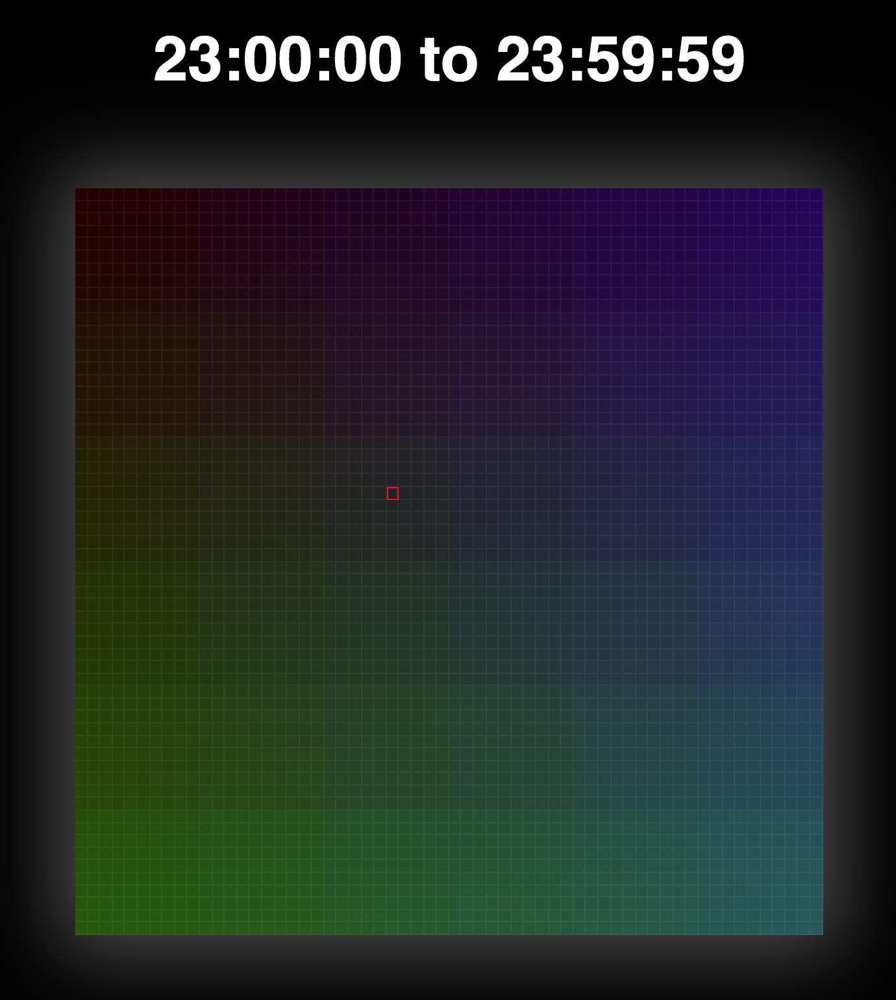

# Hexidecimal Time Swatch

[View a live demo here](https://noccer.github.io/hexidecimal-time-swatch/)

A simple single page app that prints out every second of a given hour as a colour swatch. Hover over each cell to see what time of the day the colour represented.

## What is it?

In html pages, you can choose to colour an element using the [hexidecimal colour system](https://en.wikipedia.org/wiki/Hexadecimal).

> Example 1: `#000000` represents black
> 

>   I am a div with background colour #000000;
>

> Example 2: `#ff0000` represents red
> 

>   I am a div with background colour #ff0000;
>

That means that any time of the 24-hour day from `00:00:00` to `23:59:59` can be represented as a colour:

> Example 3: `#113949` represents 11:39:49am
> 

>   I am a div with background colour #113949, which was derived from `11:39:49am`;
>

## Eh, but what does this repo do?

Well it takes the current hour, performas a loop over all 3600 seconds and renders a colour cell for each of those seconds. Neat!

    

## Todo

- rebuild in React maybe
- add a counter interval to update the highlighted cell every time a second ticks.